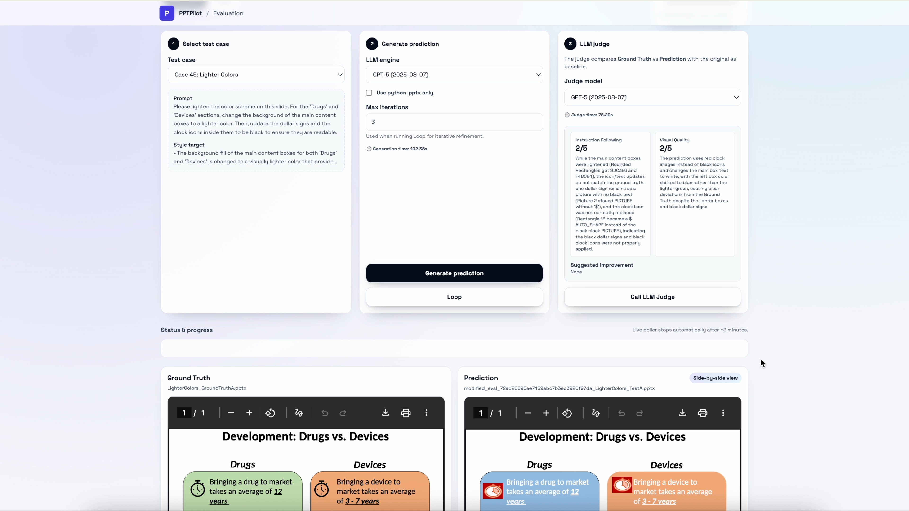
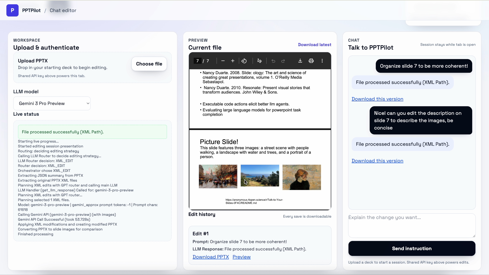

# PPTArena: A Benchmark for Agentic PowerPoint Editing

<div align="center">

[](https://arxiv.org/abs/2512.03042)
[](https://opensource.org/licenses/MIT)


<br>


</div>

## Abstract

We introduce **PPTArena**, a benchmark for PowerPoint editing that measures reliable modifications to real slides under natural-language instructions. In contrast to image-PDF renderings or text-to-slide generation, PPTArena focuses on in-place editing across 100 decks, 2125 slides, and over 800 targeted edits covering text, charts, tables, animations, and master-level styles. Each case includes a ground-truth deck, a fully specified target outcome, and a dual VLM-as-judge pipeline that separately scores instruction following and visual quality using both structural diffs and slide images. 

Building on this setting, we propose **PPTPilot**, a structure-aware slide-editing agent that plans semantic edit sequences, routes between high-level programmatic tools and deterministic XML operations for precise control, and verifies outputs through an iterative plan-edit-check loop against task-specific constraints. In our experiments, PPTPilot outperforms strong proprietary agents and frontier VLM systems by over 10 percentage points on compound, layout-sensitive, and cross-slide edits, with particularly large gains in visual fidelity and deck-wide consistency.

## Features

- **Agentic Editing**: Edit PowerPoint presentations using natural language instructions.
- **Dual-View Evaluation**: Compare "Original" vs "Ground Truth" slides side-by-side.
- **Iterative Refinement**: The agent plans, executes, and verifies edits in a loop.
- **Multi-Modal Judge**: Automated evaluation using VLM-as-a-judge for both instruction following and visual quality.
- **Comprehensive Benchmark**: Covers diverse tasks including text editing, chart manipulation, layout adjustments, and image handling.

<div align="center">

<p><em>Interactive Chat Interface for Slide Editing</em></p>
</div>

## Directory Structure

- `src/`: Core application code (Flask app, LLM handlers, PPT processing).
- `Original/`: Benchmark dataset - Original PowerPoint files.
- `GroundTruth/`: Benchmark dataset - Ground Truth PowerPoint files.
- `evaluation_pairs_refined.json`: Metadata defining the benchmark tasks.
- `paper/`: Contains the paper LaTeX source and figures.

## Installation

1.  **Clone the repository:**
    ```bash
    git clone https://github.com/michaelofengenden/PPTArena.git
    cd PPTArena
    ```

2.  **Install dependencies:**
    ```bash
    pip install -r requirements.txt
    ```

3.  **Configure API Keys:**
    Create a `credentials.env` file in the root directory:
    ```env
    OPENAI_API_KEY=your_openai_key
    GEMINI_API_KEY=your_gemini_key
    ```

## Usage

1.  **Start the Application:**
    ```bash
    python src/app.py
    ```

2.  **Access the Web Interface:**
    Open `http://localhost:5000` in your browser.

3.  **Evaluate:**
    - Go to the **Evaluation** tab.
    - Select a test case to see the Original and Ground Truth.
    - Click "Generate prediction" to run the agent on the task.
    - Use "Call LLM Judge" to score the result.

4.  **Chat & Edit:**
    - Go to the **Chat** tab.
    - Upload any `.pptx` file.
    - Type instructions like "Change the title font to Arial" or "Add a bar chart with this data...".

## Citation

If you find this work useful, please cite our paper:

```bibtex
@article{ofengenden2025pptarena,
  title={PPTArena: A Benchmark for Agentic PowerPoint Editing},
  author={Ofengenden, Michael and Man, Yunze and Pang, Ziqi and Wang, Yu-Xiong},
  journal={arXiv preprint arXiv:2512.03042},
  year={2025}
}
```
